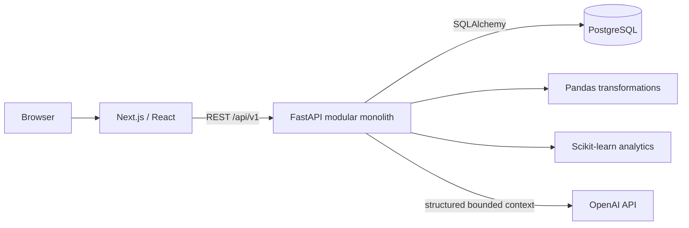

# SalesSnap

[](https://github.com/ysantosengineer/SalesSnap/actions/workflows/validation.yml)

SalesSnap is a production-oriented, multi-tenant sales-intelligence SaaS portfolio project. It turns validated sales and inventory data into descriptive analytics, customer segmentation, demand forecasts, anomaly signals, stock-out risk, evidence-backed AI insights, and a controlled analytics chat.

The repository demonstrates full-stack product engineering: typed API design, tenant isolation, transactional ingestion, statistical and machine-learning pipelines, safe LLM orchestration, PostgreSQL migrations, observability, security hardening, containers, and automated quality gates.

## Product problem

Commercial teams often keep sales and inventory data in disconnected spreadsheets. Reporting is manual, predictions are difficult to validate, and generic AI assistants lack trustworthy business context. SalesSnap provides one governed flow from imported data to explainable decision support while keeping company data isolated.

## Capabilities

- Company-scoped registration, login, short-lived JWT access tokens, and rotating HttpOnly refresh tokens.
- Bounded UTF-8 sales CSV ingestion with row validation, partial rejection, and Dataset lifecycle tracking.
- Revenue, units, sales records, active customers, average sale value, time series, and top-product analytics.
- Deterministic RFM customer scoring and segmentation.
- Daily product-demand forecasting with chronological evaluation against a naive baseline.
- Explainable demand-anomaly detection using past-only robust statistics and Isolation Forest.
- Inventory snapshot import and projected stock-out risk based on the selected demand forecast.
- Evidence-backed AI Insights generated only from structured tenant-aware analytics.
- User-private AI Chat with strict, read-only analytical tools and persisted evidence.
- Structured logs, request correlation, readiness checks, rate limiting, hardened headers, production containers, and CI validation.

## Architecture



Next.js owns presentation and interaction. FastAPI owns authorization, business rules, orchestration, and analytical APIs. PostgreSQL is the source of truth and performs tenant-scoped filtering and aggregation. Pandas handles bounded transformations, scikit-learn implements forecasting and anomaly models, and OpenAI interprets facts without direct database access.

SalesSnap is intentionally a modular monolith. It does not introduce microservices, queues, Redis, Kafka, Celery, or Kubernetes without a demonstrated requirement.

## Data and AI flow

```text
Authenticated user
  → server-derived company context
  → validated sales/inventory ingestion
  → PostgreSQL tenant-scoped records and aggregates
  → deterministic analytics and bounded ML results
  → optional structured AI interpretation
  → evidence-backed UI response
```

The LLM never calculates KPIs, executes SQL, chooses a tenant, writes business data, browses the web, or registers tools. AI Chat can call only the application-owned analytics registry; the server validates arguments, injects tenant authority, bounds history/tool calls/output, and derives evidence from actual tool results.

## Technology

| Area | Stack |
| --- | --- |
| Frontend | Next.js 16, React, TypeScript, App Router, Tailwind CSS |
| Backend | Python 3.12+, FastAPI, Pydantic |
| Persistence | PostgreSQL 17, SQLAlchemy, Alembic |
| Data and ML | Pandas, scikit-learn |
| Generative AI | OpenAI Responses API integration |
| Quality | pytest, Ruff, ESLint, npm audit, pip-audit |
| Infrastructure | Docker, Docker Compose, GitHub Actions |

## Security and tenancy

- Every protected request derives `company_id` from the authenticated user; client-selected tenant authority is rejected.
- Passwords use Argon2 hashing. Raw refresh tokens, passwords, and provider keys are never persisted or logged.
- Production starts fail fast for placeholder secrets, debug mode, unsafe CORS, a default database URL, or enabled AI without a key.
- Authentication is rate-limited by client IP; expensive authenticated operations are limited by user.
- CSP, clickjacking, MIME-sniffing, permissions, and referrer headers protect the frontend.
- Errors exposed to clients are sanitized; request logs are structured and correlated with `X-Request-ID`.

## Run locally

Requirements: Python 3.12+, Node.js 24+, npm, and PostgreSQL 17 or Docker.

```powershell
git clone https://github.com/ysantosengineer/SalesSnap.git
cd SalesSnap
Copy-Item .env.example .env
docker compose up -d postgres

cd apps/api
python -m pip install -e ".[dev]"
python -m alembic upgrade head
python -m uvicorn app.main:app --reload
```

In another terminal:

```powershell
cd apps/web
npm ci
npm run dev
```

- Web application: `http://localhost:3000`
- OpenAPI documentation: `http://localhost:8000/docs`
- Liveness: `http://localhost:8000/api/v1/health`
- Readiness: `http://localhost:8000/api/v1/readiness`

Set a local high-entropy `JWT_SECRET_KEY` in the untracked `.env`. AI remains disabled by default; enabling it additionally requires `OPENAI_API_KEY` and `AI_INSIGHTS_ENABLED=true`. See [local development](./docs/development.md) for database URL details and test setup.

## Validation

The suite currently contains **178 backend tests**: 168 isolated tests plus 10 tests against real PostgreSQL. The production smoke flow exercises registration, login, sales import, dashboard, RFM, forecast, anomalies, inventory, stock risk, safe disabled AI states, and logout.

```powershell
cd apps/api
python -m ruff check .
python -m pytest -m "not postgres"
$env:POSTGRES_TEST_DATABASE_URL="postgresql+psycopg://.../sales_snap_test"
python -m pytest -m postgres
python -m pip_audit

cd ../web
npm audit --omit=dev --audit-level=high
npm run lint -- --max-warnings=0
npm run build
```

GitHub Actions repeats these checks, scans tracked content for high-confidence secrets, applies migrations to PostgreSQL, and builds both production images.

## Production containers

`docker-compose.prod.yml` builds non-root, multi-stage images; waits for PostgreSQL; executes migrations in a one-shot service; then starts the API and web application behind readiness checks.

```powershell
docker compose --env-file .env.production -f docker-compose.prod.yml build
docker compose --env-file .env.production -f docker-compose.prod.yml up -d
```

See [deployment](./docs/deployment.md), [operations](./docs/operations.md), and [production readiness](./docs/production-readiness.md). No public environment is currently deployed by this repository.

The product interface follows a documented visual identity, shared component foundation, explicit data states, and responsive navigation architecture. See the [design system guide](./docs/design-system.md).

## API surface

All APIs are versioned under `/api/v1`. Main groups include `/auth`, `/datasets`, `/dashboard`, `/analytics/rfm`, `/analytics/forecast`, `/analytics/anomalies`, `/inventory`, `/analytics/stock-risk`, `/analytics/ai-insights`, and `/chat`. The running OpenAPI document at `/docs` is authoritative.

## Repository structure

```text
SalesSnap/
├── apps/
│   ├── api/                 FastAPI, domain services, models, migrations, tests
│   └── web/                 Next.js application and typed API clients
├── Skills/                  permanent engineering and architectural rules
├── docs/                    developer, product, analytics, AI, and operations docs
├── .github/workflows/       CI quality gates
├── docker-compose.yml       local PostgreSQL
└── docker-compose.prod.yml  production-oriented stack
```

## Engineering decisions and limitations

- Decimal money values are preserved in the backend; formatting belongs to the frontend.
- PostgreSQL aggregates data before bounded Pandas or model processing.
- Forecast evaluation is chronological and compared with a mandatory naive baseline.
- Anomaly detection identifies unusual behavior, not causation.
- Inventory represents point-in-time snapshots, not a warehouse ledger.
- AI, forecasts, anomalies, and stock risk are decision support, not autonomous operations.
- The current in-memory rate limiter assumes one API instance; horizontal scaling requires a future shared-limiter design.
- The codebase is production-ready, but cloud hosting, TLS termination, managed backups, DNS, and alert delivery depend on the chosen deployment platform.

## Project governance

Before changing the project, read every Markdown file in [Skills](./Skills). Those files are the permanent source of architectural, security, testing, database, AI, production, and Git workflow decisions. See the completed delivery sequence in [the roadmap](./docs/roadmap.md).

## License

Licensed under the [MIT License](./LICENSE).
