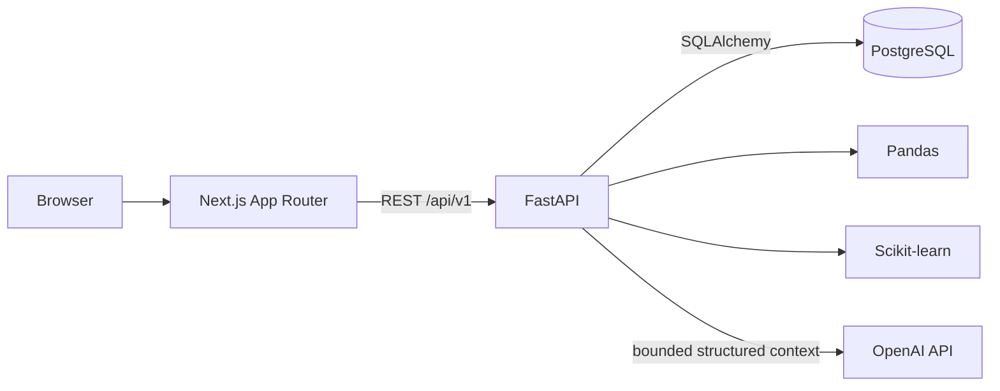

# Architecture

SalesSnap is a multi-tenant modular monolith. The deployable web and API processes are separate, while business capabilities remain modules inside one FastAPI application and one shared PostgreSQL schema.



## Responsibilities

- Next.js provides authentication screens, a responsive domain-grouped application shell, reusable interface primitives, explicit loading/error/empty/success states, and typed REST clients. It does not calculate business analytics.
- FastAPI authenticates requests, derives company authority, validates inputs, orchestrates services, applies rate limits, and returns versioned schemas.
- PostgreSQL is the persistence source of truth and performs tenant filtering, joins, constraints, ordering, and analytical aggregation.
- Pandas handles bounded CSV and time-series transformations after database scoping.
- Scikit-learn evaluates demand forecasts and anomaly signals with deterministic settings.
- OpenAI interprets existing structured facts. It has no direct database, SQL, web, write, or tenant-selection capability.

## Domain flow

```text
User → Company → Datasets → Sales/Inventory
     → Dashboard/RFM/Forecast/Anomalies/Stock Risk
     → AI Insights/AI Chat
```

Tenant-owned tables carry `company_id`. Protected services receive this server-derived value explicitly, and cross-tenant object lookups behave as not found. AI Chat further scopes conversations to both company and user.

Sales ingestion is synchronous and transactional. Analytics are computed on demand from persisted data. Forecast models and anomaly results are not persisted. Inventory snapshots are point-in-time quantities, and stock risk reuses the existing forecast service instead of training another model.

## Runtime architecture

The production compose stack contains PostgreSQL, a one-shot Alembic migration service, the non-root API container, and the non-root standalone Next.js container. API liveness is independent from dependencies; readiness verifies PostgreSQL. OpenAI remains optional and does not block deterministic product capabilities.

Structured request logs include correlation IDs and latency without request bodies or secrets. A process-local rate limiter protects sensitive and expensive paths for a single API instance. See [architecture audit](./architecture-audit.md) and [production readiness](./production-readiness.md).
